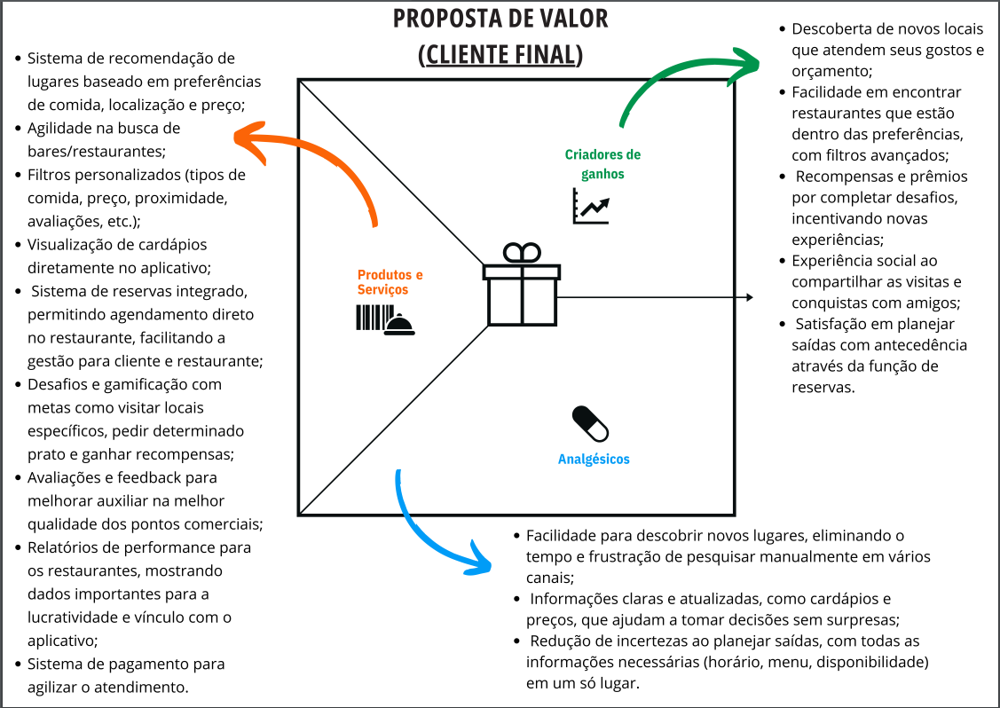
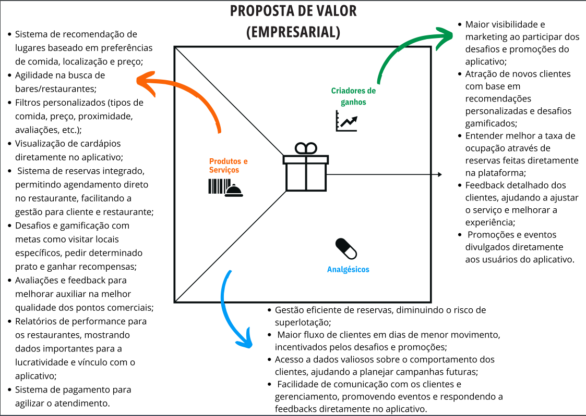
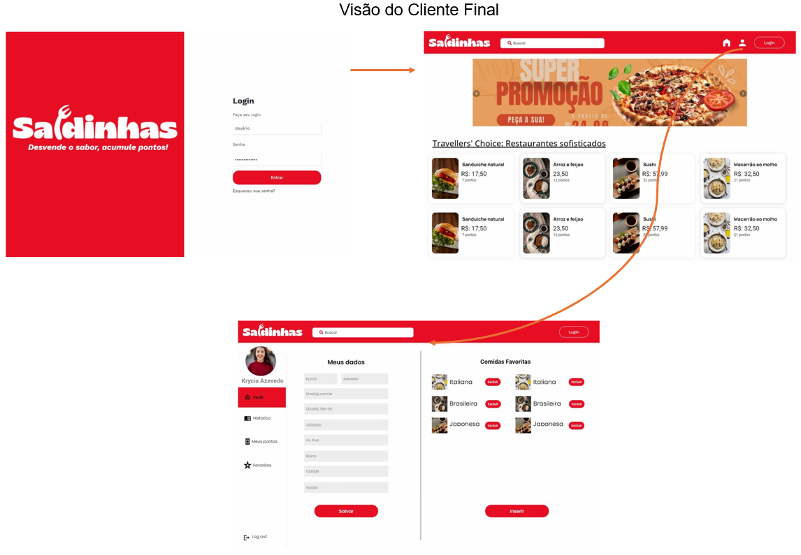
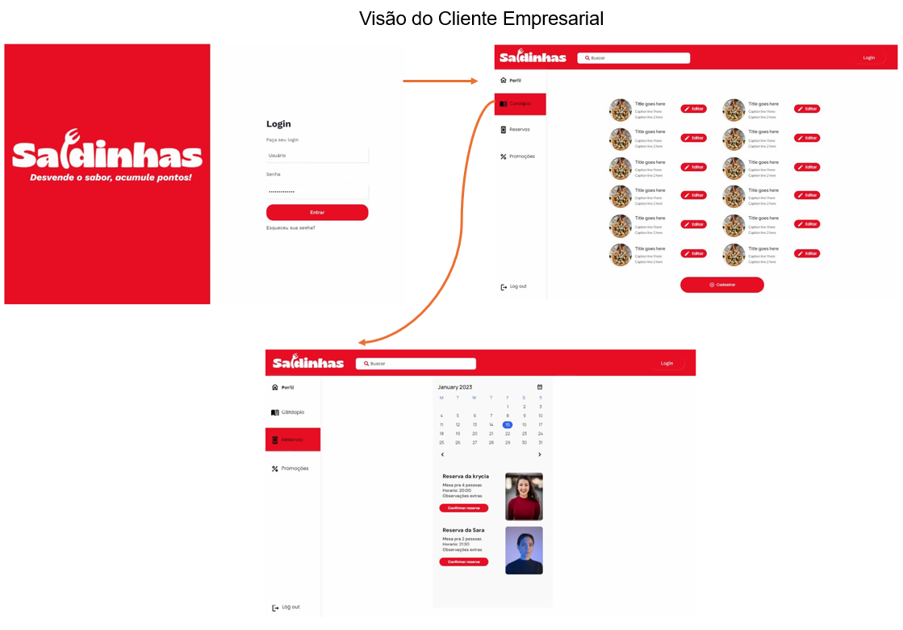

# Introdução

Informações básicas do projeto.

* **Projeto:** Saidinhas
* **Repositório GitHub:** https://github.com/ICEI-PUC-Minas-PBE-ADS-SI/pbe-si-ads-2024-2-tiaw-t1-pbe-si-ads-2024-2-tiaw-t1-saidinhas
* **Membros da equipe:**

  * [Edimar Henrique Caetano](https://github.com/Edimar09)
  * [Gabriel Henrique da Silva Santos](https://github.com/gabrielHS204)
  * [Geovanna Quezia Oliveira de Cassia](https://github.com/GeovannaCassia)
  * [Krycia Figueiredo Azevedo](https://github.com/Kryciaf)
  * [Sara de Almeida Pasolini](https://github.com/SaraPasolini)
  * [Yasmym Silva Cardoso](https://github.com/Yasmym-silva)

A documentação do projeto é estruturada da seguinte forma:

1. Introdução
2. Contexto
3. Product Discovery
4. Product Design
5. Metodologia
6. Solução
7. Referências Bibliográficas

✅ [Documentação de Design Thinking (MIRO)](files/processo-dt.pdf)

# Contexto

Detalhes sobre o espaço de problema, os objetivos do projeto, sua justificativa e público-alvo.

## Problema

 A indústria de restaurantes enfrenta um cenário complexo, onde a concorrência acirrada e a evolução das expectativas do consumidores criam desafios significativos para atrair novos clientes, engajar os atuais, enquanto lidam com a pressão por serviços de alta qualidade e eficiência. Paralelamente, os consumidores se deparam com a dificuldade de encontrar novos lugares para explorar em meio a um mar de opções, resultando em frustração e indecisão.
 
 A falta de uma ferramenta que conecte de maneira eficaz os consumidores a estabelecimentos que atendam suas preferências e desejos pode levar à perda de oportunidades tanto para os clientes quanto para os restaurantes (SERRA, 2020).
 
 O desafio que este projeto pretende solucionar está relacionado diretamente com a criação de uma solução tecnológica que não apenas melhore a eficiência operacional dos restaurantes, mas também proporcione aos consumidores uma forma simples e eficaz de descobrir novos lugares que se alinhem aos seus interesses. Disponibilizar uma aplicação útil, que consiga capturar a atenção e engajar usuários, por meio de ferramentas interativas, como sistemas de recompensas, níveis e contagem de pontos que são acumulados ao completar desafios.


## Objetivos

O principal objetivo deste projeto é desenvolver uma solução intuitiva que facilite a busca por restaurantes, bares e centros comerciais para momentos de socialização e refeições. Além de melhorar a experiência do cliente ao encontrar o local ideal, a solução também servirá como uma ferramenta para os proprietários gerenciarem seus clientes e aprimorarem o atendimento.

    3.1 Objetivos Específicos
    
* Desenvolver uma aplicação que simplifique a busca e escolha do cliente por restaurantes e bares;
* Implementar um sistema de gamificação, com recompensas, para incentivar e premiar os clientes;
* Analisar os fatores que mais atraem e ajudam na retenção de clientes;
* Proporcionar uma análise sobre a adoção de tecnologias de gestão empresarial customizando relatórios de acesso de usuários;
* Melhorar a eficiência operacional relacionada ao serviço de reservas e gestão de pagamentos;
* Conectar os donos de estabelecimentos diretamente com o cliente final

## Justificativa

A escolha de desenvolver uma solução que facilite a busca por restaurantes, bares e centros comerciais pode ser justificada pela crescente demanda dos consumidores por experiências gastronômicas personalizadas e ágeis, além do desafio de proprietários de restaurantes e bares de se destacar em um mercado saturado, onde a reputação online e o engajamento do cliente são cruciais para o sucesso.

Em um cenário onde a concorrência é intensa e as opções são vastas, é essencial que os clientes possam encontrar rapidamente locais que atendam às suas preferências e necessidades. A dificuldade em fazer essas escolhas pode levar à insatisfação e desmotivação.

Sair para comer em bares e restaurantes já é um hábito bastante enraizado dos brasileiros. 93% dos entrevistados fazem refeições fora do lar, mais da metade deles de duas a cinco vezes por mês. O principal motivo é o lazer, como ir a alguma celebração ou festa (76,6%), conversar com amigos e se divertir (76,3%) ou beber (64,8%). Dessa forma, otimizar o tempo na escolha de um ambiente agradável, é essencial para que o cliente se sinta mais motivado a consumir algo fora de sua casa e tornar o estabelecimento mais propício à procura na sua região (VIEIRA, 2024).

Um estudo que aborda essa necessidade foi conduzido por GOMES (2023), que relata que, numa pesquisa inicial realizada com 65 participantes entre 18 e 60 anos sobre a criação de um aplicativo para mapeamento de estabelecimentos no ramo alimentício, 100% dos entrevistados responderam que o aplicativo ajudaria. Desses, 26,9% disseram sair para comer fora de casa 1 vez na semana, e ainda 91% gostam de conhecer novos lugares para comer. E 97% deles afirmou que o aplicativo mudaria a forma com que conduzem as buscas por esses novos lugares.

Esses dados, aliados aos dados já mencionados, corroboram fortemente a importância da criação de um ambiente para resolução da carência na procura por locais, como bares e restaurantes, uma vez que aumentaria a praticidade e traria mais satisfação no ato da procura. A implementação de uma plataforma que não apenas facilite a descoberta de novos estabelecimentos, mas também ofereça recursos para gerenciamento de reservas e pagamentos e disponibilize de forma “lúdica” a gamificação como forma de incentivo pode resultar em uma relação mais forte entre consumidores e restaurantes e torna a experiência mais envolvente, incentivando a fidelização e promovendo visitas regulares.


## Público-Alvo

Embora seja um desafio descobrir novos locais para refeições ou lazer, e até mesmo encontrar opções gastronômicas que se destaquem, o público-alvo desta aplicação foi definido como homens e mulheres de todas as faixas etárias, com interesse em explorar novos restaurantes e bares e que busquem mais autonomia na escolha do local ideal.

Para entender melhor nosso público, conduzimos entrevistas qualitativas, que revelaram alguns pontos de interesse
 1. É comum observar que os usuários frequentemente enfrentam dificuldades ao tentar identificar um local interessante para suas saídas de lazer. Essa dificuldade surge, em grande parte, da vasta quantidade de opções disponíveis, o que pode gerar uma sensação de indecisão. Além disso, muitos usuários não têm acesso a informações claras e detalhadas dos estabelecimentos, como atrações específicas, eventos especiais, reputação do local, opiniões de outros clientes e a relação custo-benefício ou características únicas que poderiam tornar o local mais atraente. Esse processo de decisão é muitas vezes impactado pela falta de ferramentas eficazes que ajudem a comparar as diferentes opções de maneira prática e objetiva;

 2. Para a escolha do local ideal para sair, os usuários tendem a preferir ambientes que ofereçam não apenas entretenimento, mas também uma experiência gastronômica de alta qualidade. Eles valorizam espaços que proporcionem um equilíbrio entre diversão e conforto, como áreas amplas e agradáveis para descanso, e uma variedade de opções de alimentação que atendam às mais diversas preferências. A infraestrutura do local, acessibilidade, design acolhedor e o conforto oferecido, também é um fator decisivo para a escolha. Locais que conseguem atender a essas expectativas tendem a se destacar e a conquistar uma base fiel de visitantes;
 
 3. As ferramentas de busca são projetadas para serem eficientes, sobretudo quando o usuário sabe como utilizá-las adequadamente. No entanto, usuários com menos conhecimento ou experiência nessas plataformas podem enfrentar diversos obstáculos durante a busca. Um exemplo comum é não saber exatamente quais termos de pesquisa usar, o que pode resultar em respostas irrelevantes ou abrangentes, fazendo com que o usuário não encontre exatamente o que procura;
 
 4. Usuários que tiveram experiências positivas em um local, muitas vezes sentem-se motivados a compartilhar essa experiência com outras pessoas e tendem a se sentir à vontade para recomendar o local. Entretanto, é importante destacar que, embora o desejo de recomendar seja alto, muitos usuários preferem fazê-lo de maneira informal. Em vez de usar aplicativos ou plataformas online para deixar suas avaliações, muitos ainda optam por recomendar verbalmente durante conversas pessoais com conhecidos.
 
Foi também elaborado um questionário direcionado aos proprietários de centros comerciais mas, infelizmente, não recebemos respostas.

---

# Product Discovery

## Etapa de Entendimento

- [Matriz CSD](https://github.com/ICEI-PUC-Minas-PBE-ADS-SI/pbe-si-ads-2024-2-tiaw-t1-pbe-si-ads-2024-2-tiaw-t1-saidinhas/blob/1d0042e50dc12149b251bd1d59941c8a42697a8c/docs/files/02%20-%20Matriz%20CSD.md)

- [Mapa de stakeholders e perfil do usuário](https://github.com/ICEI-PUC-Minas-PBE-ADS-SI/pbe-si-ads-2024-2-tiaw-t1-pbe-si-ads-2024-2-tiaw-t1-saidinhas/blob/master/docs/files/Mapa%20de%20stakeholders%20e%20perfil%20de%20usu%C3%A1rio.pdf)

- [Entrevistas qualitativas e Highlights de pesquisa](https://github.com/ICEI-PUC-Minas-PBE-ADS-SI/pbe-si-ads-2024-2-tiaw-t1-pbe-si-ads-2024-2-tiaw-t1-saidinhas/blob/1d0042e50dc12149b251bd1d59941c8a42697a8c/docs/files/Entrevista%20e%20Highlights%20de%20Pesquisa%20.pdf)


## Etapa de Definição

### Personas

- [Personas Cliente Final e Empresarial](https://github.com/ICEI-PUC-Minas-PBE-ADS-SI/pbe-si-ads-2024-2-tiaw-t1-pbe-si-ads-2024-2-tiaw-t1-saidinhas/blob/1af0a6efe427aaece8ce0fa8e4a8d2cbdff774f3/docs/files/01%20-%20Especifica%C3%A7%C3%A3o%20das%20Personas.md)

# Product Design

Nesse momento, vamos transformar os insights e validações obtidos em soluções tangíveis e utilizáveis. Essa fase envolve a definição de uma proposta de valor, detalhando a prioridade de cada ideia e a consequente criação de wireframes, mockups e protótipos de alta fidelidade, que detalham a interface e a experiência do usuário.

## Histórias de Usuários

- Com base na análise das personas foram identificadas as seguintes histórias de usuários para o *Cliente final*:

| Eu como [QUEM]         | quero/desejo [O QUE]                                                    | para [POR QUE]                                                                                      |
|------------------------|------------------------------------------------------------------------|------------------------------------------------------------------------------------------------------|
| Cliente Final           | Me cadastrar no aplicativo                                             | Buscar por novos locais baseados em filtros de minha preferência e participar de desafios para receber e resgatar pontos. |
| Cliente Final           | Acessar um questionário introdutório sobre minhas preferências         | O aplicativo possa personalizar meus interesses desde o início e já me recomendar locais com base nas minhas respostas.     |
| Cliente Final           | A descrição por completo do local onde desejo ir                       | De antemão obter informações sobre o seu funcionamento (horários e dias da semana), localização e características. |
| Cliente Final           | Receber sugestões de restaurantes baseadas em meus gostos              | Eu possa encontrar facilmente lugares que atendam às minhas preferências sem perder muito tempo pesquisando. |
| Cliente Final           | Aplicar filtros personalizados (ex.: tipo de comida, faixa de preço, proximidade) | Eu possa encontrar lugares que se alinhem exatamente com o que estou buscando no momento. |
| Cliente Final           | Visualizar o cardápio dos restaurantes sugeridos diretamente no aplicativo | Eu possa avaliar as opções antes de decidir fazer uma visita e tenha maior agilidade no pedido ao chegar lá. |
| Cliente Final           | Uma ferramenta que me permite fazer reservas online                    | Escolher o local desejado onde quero estar e tornar meu atendimento mais ágil.                         |
| Cliente Final           | Participar de desafios do tipo "visite o restaurante X este mês"       | Eu possa ganhar recompensas e gamificar minhas saídas com amigos.                                      |
| Cliente Final           | Uma ferramenta para avaliar pratos e restaurantes                     | Eu possa expressar minha opinião e sempre ver avaliações feitas por outras pessoas sobre os restaurantes. |
| Cliente Final           | Ter acesso aos lugares que visitei através do histórico               | Eu possa revisitar lugares que já conheci e gostei, acompanhando o histórico das visitas.               |
| Cliente Final           | Um sistema de gamificação/recompensa                                  | Incentivar a visita aos locais com programas para resgatar pontos, promoções ou cupons.               |
| Cliente Final           | Ter acesso aos pontos, promoções e cupons que ganhei através do histórico | Automatizar o uso de pontos e cupons para planejar minhas próximas saídas e saber quantos pontos e promoções ainda tenho. |
| Cliente Final           | Uma ferramenta de busca direta                                        | Para ir diretamente a um lugar que já tenho em mente.                                                 |


- Com base na análise das personas foram identificadas as seguintes histórias de usuários para o *Cliente empresarial*:


| Eu como [QUEM]         | quero/desejo [O QUE]                                                    | para [POR QUE]                                                                                      |
|------------------------|------------------------------------------------------------------------|------------------------------------------------------------------------------------------------------|
| Cliente Empresarial     | Cadastrar meu estabelecimento no aplicativo                            | Permitir que os usuários filtrem suas preferências e encontrem mais facilmente o que oferecemos, com o objetivo de atrair nosso público-alvo de forma mais eficaz. |
| Cliente Empresarial     | Cadastrar meus horários de funcionamento no aplicativo                 | Os clientes saibam exatamente quando estamos abertos e possam planejar suas visitas.                 |
| Cliente Empresarial     | Cadastrar meu cardápio, preços, imagens e descrições no aplicativo      | Proporcionar ao nosso cliente uma experiência mais simples ao realizar seu pedido e otimizar o tempo de processamento dos pedidos. |
| Cliente Empresarial     | Criar e lançar desafios como "visite-nos esta semana e ganhe 10% de desconto" | Eu possa atrair novos clientes e aumentar o movimento em dias de menor demanda.                     |
| Cliente Empresarial     | Permitir que os clientes façam reservas diretamente pelo aplicativo     | Eu consiga gerenciar melhor a ocupação das mesas e evitar lotação.                                   |
| Cliente Empresarial     | Receber relatórios sobre quantos clientes completaram os desafios e visitaram o meu local | Eu possa avaliar a eficácia das minhas campanhas e ajustar estratégias futuras.                      |
| Cliente Empresarial     | Acessar feedback dos clientes após a visita                            | Eu possa entender sua experiência e melhorar continuamente.                                          |
| Cliente Empresarial     | Um relatório sobre a interação do cliente com meu estabelecimento       | Compreender melhor quantas pessoas visitaram meu estabelecimento através do aplicativo ou quantas acessaram a descrição do local e não realizaram a visita. |
| Cliente Empresarial     | Um sistema de geolocalização                                           | Facilitar a jornada dos usuários, mostrando a localização, a distância e o tempo necessário para percorrer o trajeto. |
| Cliente Empresarial     | Uma ferramenta segura para o pagamento                                 | Acelerar o pagamento dos clientes e simplificar o processo do pedido, visando gerenciar um maior número de clientes em uma demanda alta. |
| Cliente Empresarial     | Um sistema de gamificação e recompensas                                | Assinarmos com o aplicativo com o objetivo de atrair mais clientes, por meio de recompensas (como cupons e descontos), e incentivar a nossa base de usuários. |


## Proposta de Valor

##### Proposta para *Cliente Final*



##### Proposta para *Cliente Empresarial*




## Requisitos

As tabelas que se seguem apresentam os requisitos funcionais e não funcionais que detalham o escopo do projeto.

### Requisitos Funcionais
| RF   | Requisitos Funcionais                                                                                 | Prioridade |
| ---- | ------------------------------------------------------------------------------------------------------ | ---------- |
| RF 01| Cadastro dos usuários que deve incluir os campos obrigatórios: nome completo, CPF/CNPJ, e-mail, telefone, endereço e senha | Alta       |
| RF 02| Login dos usuários através do e-mail ou telefone                                             | Alta       |
| RF 03| Questionário inicial para identificar interesses e sugerir opções com base nessas preferências | Alta       |
| RF 04| Filtro de busca avançada                                                                     | Alta       |
| RF 05| Histórico de acesso aos locais visitados                                                     | Média      |
| RF 06| Histórico de recompensas                                                                     | Média      |
| RF 07| Sistema de reserva                                                                           | Média      |
| RF 08| Sistema de sugestões ao cliente                                                              | Média      |
| RF 09| Gamificação (acúmulo de pontos, promoções, cupons)                                           | Alta       |
| RF 10| Visualizar informações do local, sob a perspectiva do cliente                                | Média      |
| RF 11| Visualização do cardápio sob a perspectiva do cliente                                        | Média      |
| RF 12| Acessibilidade, como tema claro e escuro                                                     | Baixa      |
| RF 13| Sistema de avaliação                                                                         | Média      |
| RF 14| Sistema de pagamento                                                                         | Média      |
| RF 15| Suporte ao usuário                                                                           | Alta       |
| RF 16| Cadastro de cardápio e outros serviços oferecidos pelo cliente comercial                     | Alta       |
| RF 17| Cadastro de promoções e descontos para a gamificação das visitações ao cliente comercial      | Alta       |
| RF 18| Relatório sobre a interação do cliente com o comércio                                        | Média      |
| RF 19| Geolocalização                                                                               | Baixa      |


### Requisitos não Funcionais
| RNF   | Requisitos Não Funcionais                                                                                         |
| ----- | ------------------------------------------------------------------------------------------------------------------ |
| RNF 01| A aplicação será desenvolvida com HTML 5, CSS e Javascript.                                                        |
| RNF 02| Legislação - Agência Nacional de Vigilância Sanitária                                                             |
| RNF 03| Lei Geral de Proteção de Dados Pessoais (LGPD), Lei nº 13.709/2018.                                                |
| RNF 04| A aplicação fará uso da moeda oficial do Brasil, o real.                                                           |
| RNF 05| A aplicação fará uso do idioma oficial do Brasil, PT-BR.                                                           |
| RNF 06| A disponibilidade da aplicação será de 24x7.                                                                      |
| RNG 07| O tempo de resposta da aplicação não deverá exceder 1 segundo.                                                     |
| RNF 08| Será utilizado o GitHub como plataforma de desenvolvimento.                                                       |
| RNF 09| Deverá ser um sistema responsivo para se ajustar a qualquer dispositivo.                                           |


## Projeto de Interface

Artefatos relacionados com a interface e a interacão do usuário na proposta de solução.

### Wireframes

- [Estes são os protótipos de telas do sistema](https://github.com/ICEI-PUC-Minas-PBE-ADS-SI/pbe-si-ads-2024-2-tiaw-t1-pbe-si-ads-2024-2-tiaw-t1-saidinhas/blob/7531949e51100c2b30fdef809a738101888aa913/docs/files/Prot%C3%B3tipos.pdf)


### User Flow

**User FLow Cliente Final**


**User FLow Cliente Empresarial**



-- -- -- - -- -- -- -- -- -- -- -- -- -- -- -- -- -- -- -- -- -- -- -- -- -- -- -- -- -- -- -- -- -- -- -- -- -- --


### Protótipo Interativo

**✳️✳️✳️ COLOQUE AQUI UM IFRAME COM SEU PROTÓTIPO INTERATIVO ✳️✳️✳️**

✅ [Protótipo Interativo (MarvelApp)](https://marvelapp.com/prototype/4hd6091?emb=1&iosapp=false&frameless=false)  ⚠️ EXEMPLO ⚠️

> ⚠️ **APAGUE ESSA PARTE ANTES DE ENTREGAR SEU TRABALHO**
>
> Um protótipo interativo apresenta o projeto de interfaces e permite ao usuário navegar pelas funcionalidades como se estivesse lidando com o software pronto. Utilize as mesmas ferramentas de construção de wireframes para montagem do seu protótipo interativo. Inclua o link para o protótipo interativo do projeto.

# Metodologia

Detalhes sobre a organização do grupo e o ferramental empregado.

## Ferramentas

Relação de ferramentas empregadas pelo grupo durante o projeto.

| Ambiente                    | Plataforma | Link de acesso                                     |
| --------------------------- | ---------- | -------------------------------------------------- |
| Processo de Design Thinking | Miro       | https://miro.com/XXXXXXX ⚠️ EXEMPLO ⚠️        |
| Repositório de código     | GitHub     | https://github.com/XXXXXXX ⚠️ EXEMPLO ⚠️      |
| Hospedagem do site          | Render     | https://site.render.com/XXXXXXX ⚠️ EXEMPLO ⚠️ |
| Protótipo Interativo       | MarvelApp  | https://marvelapp.com/XXXXXXX ⚠️ EXEMPLO ⚠️   |
|                             |            |                                                    |

> ⚠️ **APAGUE ESSA PARTE ANTES DE ENTREGAR SEU TRABALHO**
>
> Liste as ferramentas empregadas no desenvolvimento do projeto, justificando a escolha delas, sempre que possível. Inclua itens como: (1) Editor de código, (2) )ferramentas de comunicação, (3) )ferramentas de diagramação, (4) )plataformas de hospedagem, entre outras.

## Gerenciamento do Projeto

Divisão de papéis no grupo e apresentação da estrutura da ferramenta de controle de tarefas (Kanban).


> ⚠️ **APAGUE ESSA PARTE ANTES DE ENTREGAR SEU TRABALHO**
>
> Nesta parte do documento, você deve apresentar  o processo de trabalho baseado nas metodologias ágeis, a divisão de papéis e tarefas, as ferramentas empregadas e como foi realizada a gestão de configuração do projeto via GitHub.
>
> Coloque detalhes sobre o processo de Design Thinking e a implementação do Framework Scrum seguido pelo grupo. O grupo poderá fazer uso de ferramentas on-line para acompanhar o andamento do projeto, a execução das tarefas e o status de desenvolvimento da solução.
>
> **Orientações**:
>
> - [Sobre Projects - GitHub Docs](https://docs.github.com/pt/issues/planning-and-tracking-with-projects/learning-about-projects/about-projects)
> - [Gestão de projetos com GitHub | balta.io](https://balta.io/blog/gestao-de-projetos-com-github)
> - [(460) GitHub Projects - YouTube](https://www.youtube.com/playlist?list=PLiO7XHcmTsldZR93nkTFmmWbCEVF_8F5H)
> - [11 Passos Essenciais para Implantar Scrum no seu Projeto](https://mindmaster.com.br/scrum-11-passos/)
> - [Scrum em 9 minutos](https://www.youtube.com/watch?v=XfvQWnRgxG0)

# Solução Implementada

Esta seção apresenta todos os detalhes da solução criada no projeto.

## Vídeo do Projeto

O vídeo a seguir traz uma apresentação do problema que a equipe está tratando e a proposta de solução. ⚠️ EXEMPLO ⚠️

[](https://www.youtube.com/embed/70gGoFyGeqQ)

> ⚠️ **APAGUE ESSA PARTE ANTES DE ENTREGAR SEU TRABALHO**
>
> O video de apresentação é voltado para que o público externo possa conhecer a solução. O formato é livre, sendo importante que seja apresentado o problema e a solução numa linguagem descomplicada e direta.
>
> Inclua um link para o vídeo do projeto.

## Funcionalidades

Esta seção apresenta as funcionalidades da solução.Info

##### Funcionalidade 1 - Cadastro de Contatos ⚠️ EXEMPLO ⚠️

Permite a inclusão, leitura, alteração e exclusão de contatos para o sistema

* **Estrutura de dados:** [Contatos](#ti_ed_contatos)
* **Instruções de acesso:**
  * Abra o site e efetue o login
  * Acesse o menu principal e escolha a opção Cadastros
  * Em seguida, escolha a opção Contatos
* **Tela da funcionalidade**:


> ⚠️ **APAGUE ESSA PARTE ANTES DE ENTREGAR SEU TRABALHO**
>
> Apresente cada uma das funcionalidades que a aplicação fornece tanto para os usuários quanto aos administradores da solução.
>
> Inclua, para cada funcionalidade, itens como: (1) titulos e descrição da funcionalidade; (2) Estrutura de dados associada; (3) o detalhe sobre as instruções de acesso e uso.

## Estruturas de Dados

Descrição das estruturas de dados utilizadas na solução com exemplos no formato JSON.Info

##### Estrutura de Dados - Contatos   ⚠️ EXEMPLO ⚠️

Contatos da aplicação

```json
  {
    "id": 1,
    "nome": "Leanne Graham",
    "cidade": "Belo Horizonte",
    "categoria": "amigos",
    "email": "Sincere@april.biz",
    "telefone": "1-770-736-8031",
    "website": "hildegard.org"
  }
  
```

##### Estrutura de Dados - Usuários  ⚠️ EXEMPLO ⚠️

Registro dos usuários do sistema utilizados para login e para o perfil do sistema

```json
  {
    id: "eed55b91-45be-4f2c-81bc-7686135503f9",
    email: "admin@abc.com",
    id: "eed55b91-45be-4f2c-81bc-7686135503f9",
    login: "admin",
    nome: "Administrador do Sistema",
    senha: "123"
  }
```

> ⚠️ **APAGUE ESSA PARTE ANTES DE ENTREGAR SEU TRABALHO**
>
> Apresente as estruturas de dados utilizadas na solução tanto para dados utilizados na essência da aplicação quanto outras estruturas que foram criadas para algum tipo de configuração
>
> Nomeie a estrutura, coloque uma descrição sucinta e apresente um exemplo em formato JSON.
>
> **Orientações:**
>
> * [JSON Introduction](https://www.w3schools.com/js/js_json_intro.asp)
> * [Trabalhando com JSON - Aprendendo desenvolvimento web | MDN](https://developer.mozilla.org/pt-BR/docs/Learn/JavaScript/Objects/JSON)

## Módulos e APIs

Esta seção apresenta os módulos e APIs utilizados na solução

**Images**:

* Unsplash - [https://unsplash.com/](https://unsplash.com/) ⚠️ EXEMPLO ⚠️

**Fonts:**

* Icons Font Face - [https://fontawesome.com/](https://fontawesome.com/) ⚠️ EXEMPLO ⚠️

**Scripts:**

* jQuery - [http://www.jquery.com/](http://www.jquery.com/) ⚠️ EXEMPLO ⚠️
* Bootstrap 4 - [http://getbootstrap.com/](http://getbootstrap.com/) ⚠️ EXEMPLO ⚠️

> ⚠️ **APAGUE ESSA PARTE ANTES DE ENTREGAR SEU TRABALHO**
>
> Apresente os módulos e APIs utilizados no desenvolvimento da solução. Inclua itens como: (1) Frameworks, bibliotecas, módulos, etc. utilizados no desenvolvimento da solução; (2) APIs utilizadas para acesso a dados, serviços, etc.

# Referências

As referências utilizadas no trabalho foram:

* SOBRENOME, Nome do autor. Título da obra. 8. ed. Cidade: Editora, 2000. 287 p ⚠️ EXEMPLO ⚠️

> ⚠️ **APAGUE ESSA PARTE ANTES DE ENTREGAR SEU TRABALHO**
>
> Inclua todas as referências (livros, artigos, sites, etc) utilizados no desenvolvimento do trabalho.
>
> **Orientações**:
>
> - [Formato ABNT](https://www.normastecnicas.com/abnt/trabalhos-academicos/referencias/)
> - [Referências Bibliográficas da ABNT](https://comunidade.rockcontent.com/referencia-bibliografica-abnt/)
